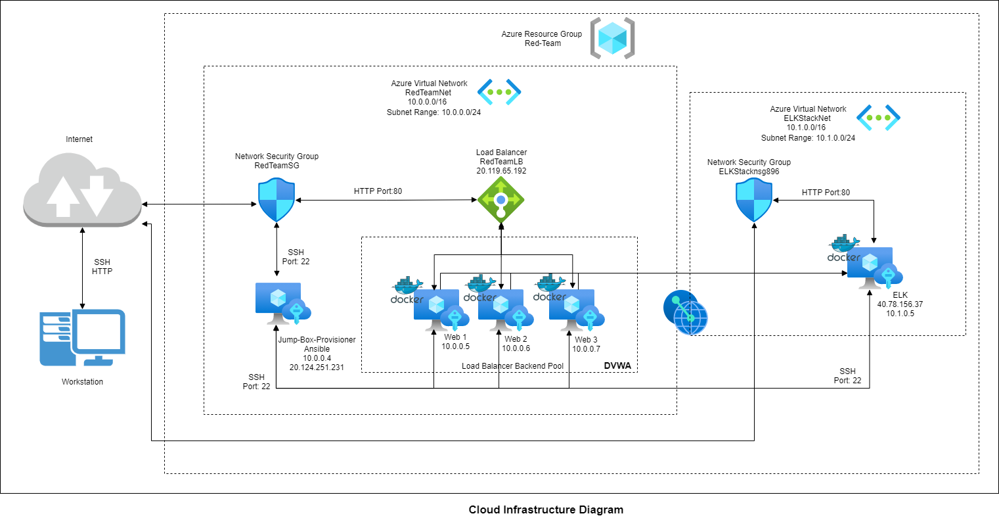
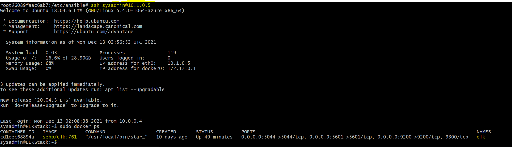

## Automated ELK Stack Deployment

The files in this repository were used to configure the network depicted below.

These files have been tested and used to generate a live ELK deployment on Azure. They can be used to either recreate the entire deployment pictured above. Alternatively, select portions of the filebeat-playbook.yml file may be used to install only certain pieces of it, such as Filebeat.

This document contains the following details:
- Description of the Topology
- Access Policies
- ELK Configuration
  - Beats in Use
  - Machines Being Monitored
- How to Use the Ansible Build

### Description of the Topology

The main purpose of this network is to expose a load-balanced and monitored instance of DVWA, the D*mn Vulnerable Web Application.

Load balancing ensures that the application will be highly available, in addition to restricting access to the network.

Integrating an ELK server allows users to easily monitor the vulnerable VMs for changes to the file and system logs.

The configuration details of each machine may be found below.
_Note: Use the [Markdown Table Generator](http://www.tablesgenerator.com/markdown_tables) to add/remove values from the table_.

| Name                 | Function          | IP Address | Operating System |
| -------------------- | ----------------- | ---------- | ---------------- |
| Jump-Box-Provisioner | Gateway           | 10.0.0.4   | Linux            |
| Web1                 | DVWA Web App host | 10.0.0.5   | Linux            |
| Web2                 | DVWA Web App host | 10.0.0.6   | Linux            |
| Web3                 | DVWA Web App host | 10.0.0.7   | Linux            |
| ELKStack             | ELK Server        | 10.1.0.5   | Linux            |

### Access Policies

The machines on the internal network are not exposed to the public Internet. 

Only the Jump-Box-Provisioner machine can accept connections from the Internet. Access to this machine is only allowed from the following IP addresses:
- 143.59.98.177

Machines within the network can only be accessed by Jump-Box-Provisioner (20.124.251.231).

A summary of the access policies in place can be found in the table below.

| Name     | Publicly Accessible | Allowed IP Addresses                     |
| -------- | ------------------- | ---------------------------------------- |
| Jump Box | Yes                 | 143.59.98.177 10.0.0.5 10.0.0.6 10.0.0.7 |
| Web 1    | No                  | 20.124.251.231                           |
| Web 2    | No                  | 20.124.251.231                           |
| Web 3    | No                  | 20.124.251.231                           |
| ELK      | Yes                 | 143.59.98.177 20.124.251.231 10.1.0.5    |

### Elk Configuration

Ansible was used to automate configuration of the ELK machine. No configuration was performed manually, which is advantageous because it helps secure, scale, quickly provision and maintain hosts using a configuration file.

The playbook implements the following tasks:

- Install Docker
- Install Python3
- Install Docker module
- Increase Virtual Memory
- Download and launch a docker elk container
- Enable Docker service on boot

The following screenshot displays the result of running `docker ps` after successfully configuring the ELK instance.

### Target Machines & Beats
This ELK server is configured to monitor the following machines:
- Web 1 (10.0.0.5)
- Web 2 (10.0.0.6)
- Web 3 (10.0.0.7)

We have installed the following Beats on these machines:
- Filebeat and Metricbeat

These Beats allow us to collect the following information from each machine:

Filebeat helps generate and organize log files to send to Logstash and Elasticsearch.  Specifically, it logs information about the file system, including which files have  changed and when.

Metricbeat helps collect metrics from the operating system and from services running on the server to send to Logstash and Elasticsearch. This information can be used to track system behavior for alert potential security threats. 

### Using the Playbook
In order to use the playbook, you will need to have an Ansible control node already configured. Assuming you have such a control node provisioned: 

SSH into the control node and follow the steps below:
- Copy the [install-elk.yml](Ansible\install-elk.yml) file to /etc/ansible.
- Update the /etc/ansible/hosts file to include new VM's ip address
- Run the playbook, and navigate to http://<ELK.VM.External.IP>:5601/app/kibana to check that the installation worked as expected.
